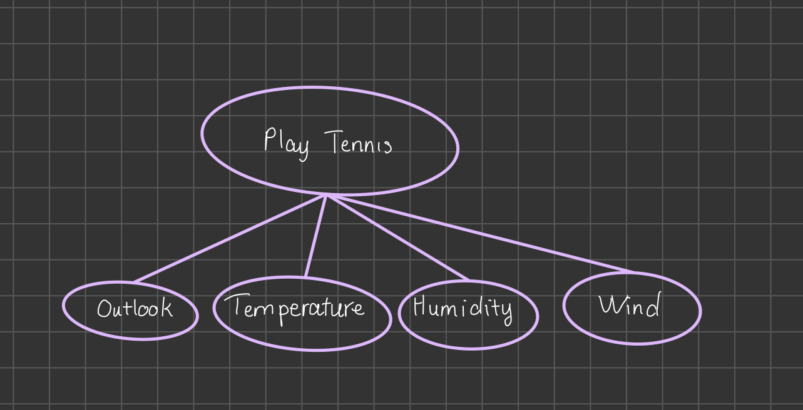
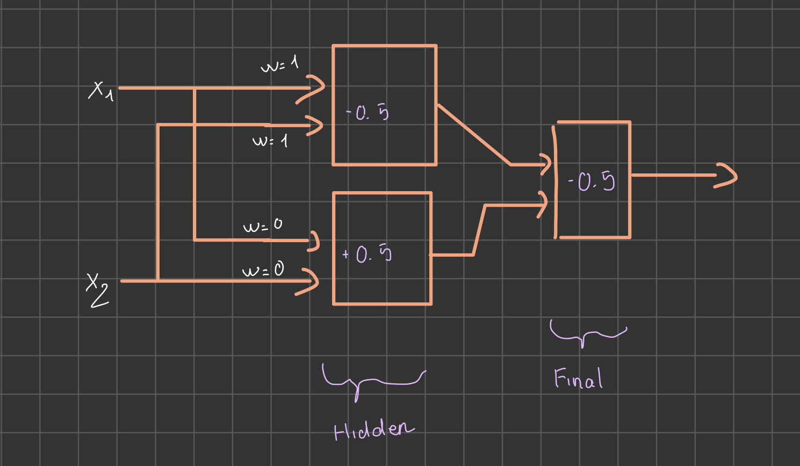
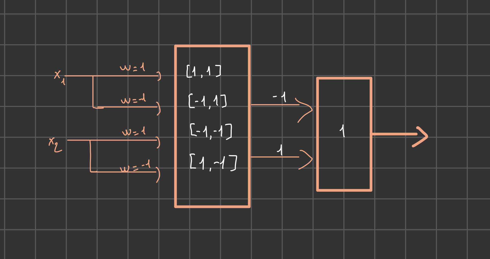

# PS12
## Problem 11.1
- Compute the Conditionl Probability Table (CPT) that would be "learned" given the 100 instances.

| G | M | B | L | Number of instances |
|---|---|---|---|---------------------|
| T | T | T | T | 54                  |
| T | T | T | F | 1                   |
| T | F | T | T | 7                   |
| T | F | T | F | 27                  |
| F | T | T | T | 3                   |
| F | F | T | F | 2                   |
| F | F | F | T | 4                   |
| F | F | F | F | 2                   |


- For B:
  - P(B=T) = (54 + 1 + 7 + 27+3+2) / 100 = 0.94
  - P(B=F) = 1 - P(B=T) = 0.06
- Table to represent B:

| G | P(G) |
|---|------|
| T | 0.94 |
| F | 0.06 |


- For L:
  - P(L=T) = (54 + 7 + 3 + 4) / 100 = 0.68
  - P(L=F) = 1 - P(L=T) = 0.32
- Table to represent L:
| L | P(L) |
|---|------|
| T | 0.68 |
| F | 0.32 |

- For G:
  - P(G=T|B=T) = (54 + 1 + 7 +27)/94 = 0.94
  - P(G=F|B=T) = 1 - P(G=T|B=T) = 0.06
  - P(G=T|B=F) = 0
  - P(G=F|B=F) = 2+4/6 = 1
- Table to represent G:

| B | P(G=T) | P(G=F) |
|---|--------|--------|
| T | 0.94   | 0.06   |
| F | 0      | 1      |


- For M:
  - P(M=T|B=T,L=T) = (54 + 3) / (54 + 3 + 4) = 57 / 61 = 0.934
  - P(M=F|B=T,L=T) = 7/(54+7+3) = 7/64 = 0.109
  - P(M=T|B=T,L=F) = 1/(1+27+2) = 1/30 = 0.033
  - P(M=F|B=T,L=F) = (27+2)/(1+27+2) = 29/30 = 0.967
  - P(M=T|B=F,L=T) = 0
  - P(M=F|B=F,L=T) = 4/4 = 1
  - P(M=T|B=F,L=F) = 0
  - P(M=F|B=F,L=F) = 2/2 = 1
- Table to represent M:
| B | L | P(M=T) | P(M=F) |
|---|---|--------|--------|
| T | T | 0.934  | 0.109  |
| T | F | 0.033  | 0.967  |
| F | T | 0      | 1      |
| F | F | 0      | 1      |


## Problem 11.2
| Day | Outlook | Temperature | Humidity | Wind  | PlayTennis |
|-----|---------|-------------|----------|-------|------------|
| 1   | Sunny   | Hot         | High     | Weak  | No         |
| 2   | Sunny   | Hot         | High     | Strong| No         |
| 3   | Overcast| Hot         | High     | Weak  | Yes        |
| 4   | Rain    | Mild        | High     | Weak  | Yes        |
| 5   | Rain    | Cool        | Normal   | Weak  | Yes        |
| 6   | Rain    | Cool        | Normal   | Strong| No         |
| 7   | Overcast| Cool        | Normal   | Strong| Yes        |
| 8   | Sunny   | Mild        | High     | Weak  | No         |
| 9   | Sunny   | Cool        | Normal   | Weak  | Yes        |
| 10  | Rain    | Mild        | Normal   | Weak  | Yes        |
| 11  | Sunny   | Mild        | Normal   | Strong| Yes        |
| 12  | Overcast| Mild        | High     | Strong| Yes        |
| 13  | Overcast| Hot         | Normal   | Weak  | Yes        |
| 14  | Rain    | Mild        | High     | Strong| No         |



| Outlook | P(Y) | P(N) |
|---------|------|------|
| Sunny   |  2/9 | 3/5  |
| Overcast|  4/9 | 0    |
| Rain    |  3/9 | 2/5  |

| Temperature | P(Y) | P(N) |
|-------------|------|------|
| Hot         | 2/9  | 2/5  |
| Mild        | 4/9  | 1/5  |
| Cool        | 2/9  | 1/5  |

| Humidity | P(Y) | P(N) |
|----------|------|------|
| High     | 3/9  | 4/5  |
| Normal   | 6/9  | 1/5  |

| Wind   | P(Y) | P(N) |
|--------|------|------|
| Weak   | 6/9  | 2/5  |
| Strong | 3/9  | 3/5  |


- C. Compute the predicted target attribute for the example appearing bellow the line under Day 14.
  - Sunny, Cool, High, Strong
  - P(Yes|Sunny,Cool,High,Strong) = P(Sunny|Yes) * P(Cool|Yes) * P(High|Yes) * P(Strong|Yes) * P(Yes) = 2/9 * 2/9 * 3/9 * 3/9 * 9/14 = 0.0053
  - P(No|Sunny,Cool,High,Strong) = P(Sunny|No) * P(Cool|No) * P(High|No) * P(Strong|No) * P(No) = 3/5 * 1/5 * 4/5 * 3/5 * 5/14 = 0.0206
  - Since the Probability of No is higher, the predicted target attribute is No.
- D. Compute the conditional probability this is correct given the observed data.
- 

## Problem 11.3


## Problem 11.4



## Problem 11.5
### A. 
- Training the perceptron with alpha = 1
- Initial weights: w1 = 0, w2 = 0, w3 = 0
| Input | Output | Prediction | New Weights |
|-------|--------|------------|-------------|
| 1,0,0 | 1      | 0          | 1,0,0,1     |
| 0,1,1 | 0      | 0          | 1,0,1,1     |
| 1,1,0 | 1      | 0          | 2,1,1,2     |
| 1,1,1 | 0      | 1          | 2,1,1,2     |
| 0,0,1 | 0      | 0          | 2,0,0,3     |
| 1,0,1 | 1      | 1          | 2,0,0,3     |
- Final weights: w1 = 2, w2 = 0, w3 = 0, w0 = 3

## Problem 11.6
```python
import numpy as np

# Define the data set and desired outputs
I = np.array([[1, 0, 0], [0, 1, 1], [1, 1, 0], [1, 1, 1], [0, 0, 1], [1, 0, 1]])
O = np.array([1, 0, 1, 0, 0, 1])

# Initialize the weight vector with zeros
w = np.zeros(I.shape[1] + 1) # Bias weight 

# Set the learning rate and maximum number of epochs
alpha = 1
max_epochs = 100

# Train the perceptron using the Perceptron Learning Rule
for epoch in range(max_epochs):
    weights_changed = False
    for i in range(I.shape[0]):
        net_input = np.dot(w[1:], I[i]) + w[0]  # add bias weight
        net_output = 1 if net_input > 0 else 0
        if net_output != O[i]:
            w[1:] += alpha * (O[i] - net_output) * I[i]
            w[0] += alpha * (O[i] - net_output)  # update bias weight
            weights_changed = True
    if not weights_changed:
        print("Converged after {} epochs".format(epoch + 1))
        break

# Print the final weight vector
print("Final weight vector: ", w)

```

- Output: Final weight vector:  [ 1, 2, -2, -1]

