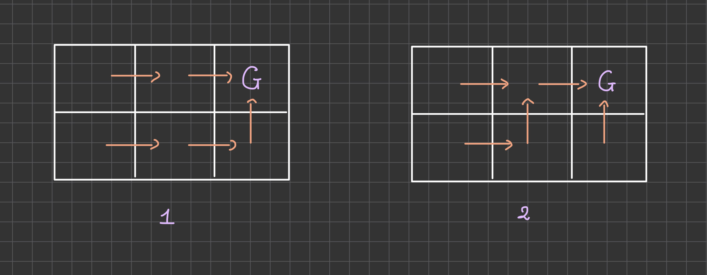
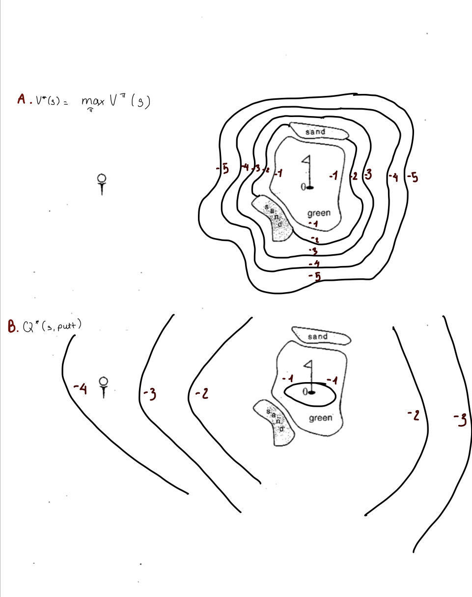

## PS12

### Problem 12.1 
- No, I haven't effectively communicated to the agent what I want it to achieve. The agent doesn't know what the goal is. The agent doesn't know what the optimal value function is. The agent doesn't know what the optimal action-value function
- Problem that I found:
  - The reward structure might not be effictively commmunicating the agent's objective.
  - This setup might not provide enough information to the agent to learn the optimal policy.
  - Agent doesn't receive any usefull feedback for taking actions that are not optimal.
- Solution:
  - Using Distance-based reward structure, every time the agent decreases the distance to the goal, it receives a reward. This way the agent will learn to move towards the goal.
  - Negative reward for every step the agent takes. This way the agent will learn to take the shortest path to the goal.

### Problem 12.2



- From the giving grid world (2 x 3):
  - The number of optimal policies  is 2

### Problem 12.3



### Problem 12.4

### Problem 12.5
```
Consider the traditional Rock-Paper-Scissors Game.
a. Construct the matrix of pure strategies (+1 = win, -1 = loss, 0 = draw).
b. Show that the mixed strategy of choosing each outcome equally at random produces a saddle solution

```
#### A. 

|        | Rock | Paper | Scissors |
|--------|------|-------|----------|
| Rock   | 0    | -1    | 1        |
| Paper  | 1    | 0     | -1       |
| Scissor| -1   | 1     | 0        |

#### B.
- Let P1 = {1/3, 1/3, 1/3} be the probability distribution of the actions of player 1.
- Let P2 = {1/3, 1/3, 1/3} be the probability distribution of the actions of player 2.

- The expect payoff for player 1 is:
  - Expected Payoff = P1 * Matrix * (P2^T)
  - E1 = [1/3 , 1/3 , 1/3] * [0, -1, 1; 1, 0, -1; -1, 1, 0] * [1/3; 1/3; 1/3] = 0
- Since the game is symmetric, the expected payoff for player 2 is also 0.
- Conclusion: this equal random choice mixed strategy forms a saddle solution, since neither player can improve their payoff by changing their strategy alone. Both players' optimal response is to maintain their mixed strategy.

### Problem 12.6 Penny Matching Game

|     | H    | T    |
|-----|------|------|
| H   | a    | b    |
| T   | c    | d    |

#### A.
- If a =$1 million, b = c = -1 cent, d = 1 cent, with what probability  should each player choose heads?

- Let 'p' be the probability of choosing heads for player 1 and (1-p) is the probability of choosing tails for player 1.
- Let 'q' be the probability of choosing heads for player 2 and (1-q) is the probability of choosing tails for player 2.


- We have the expected payoff for Player 1 is:
  - Expected Payoff = p * (a * q + b * (1-q)) + (1-p) * (c * q + d * (1-q))
  - Derivative of Expected Payoff with respect to p:
    - d/dp = ∂(p*(a * q + b * (1-q)))/ ∂p + ∂((1-p) * (c * q + d * (1-q)))/∂p
    - d/dp = p * ∂(a * q + b * (1-q))/∂p + (1-p) * ∂(c * q + d * (1-q))/∂p
    - d/dp = (a * q + b * (1-q)) * ∂p/∂p + p * ∂(a * q + b * (1-q))/∂p - (c * q + d * (1-q)) * ∂p/∂p + (1-p) * ∂(c * q + d * (1-q))/∂p
    - d/dp = (a * q + b * (1-q)) - (c * q + d * (1-q))
  - The probability of player 1 choosing heads is
    - ∂(Expected Payoff)/∂p = (a * q + b * (1-q)) - (c * q + d * (1-q)) = 0
    - Solving for q, we get:
      - O = (1000000 * q - 0.01 * (1-q)) - (-0.01 * q + 0.01 * (1-q))
      - 0 = 1000000 * q - 0.01 + 0.01 * q + 0.01 * q - 0.01 + 0.01 * q
      - 0 = (1000000 + 0.01 + 0.01 + 0.01) * q - (0.01 + 0.01)
      - 0.02 = 1000000.03 * q
      - q = 0.02/1000000.03 = 0.00000002
- So, the probability of player 1 choosing heads is 0.00000002 and the probability of player 1 choosing tails is 0.99999998.
- Since the game is symmetric, the probability of player 2 choosing heads is same as the probability of player 1 choosing heads, which is 0.00000002 and the probability of player 2 choosing tails is same as the probability of player 1 choosing tails, which is 0.99999998.

#### B. 
- The minimax strategy is pure when either p = 0, p = 1, q = 0, or q = 1. The players always choose one of the strategies, and the game is deterministic.
  - If Expected Payoff_H >= Expected Payoff_T for all q ∈ [0, 1], then p = 1 (Player 1 always chooses H)
  -  If Expected Payoff_T >= Expected Payoff_H for all q ∈ [0, 1], then p = 0 (Player 1 always chooses T)
- Compare the expected payoff for H and T:
  - a * q + b * (1-q) >= c * q + d * (1-q)
  - (a - b) * q + (b - d) >= (c - d) * q
- Base on the above inequality, we have:
  - Case 1: a - b > c - d, then p = 1 (Player 1 always chooses H)
  - Case 2: a - b < c - d, then p = 0 (Player 1 always chooses T)
- Symmetric to player 2, we have:
  - Case 1: a - b > c - d, then q = 1 (Player 2 always chooses H)
  - Case 2: a - b < c - d, then q = 0 (Player 2 always chooses T)

### Problem 12.7
```
In this problem, you will be using (passive) direct utility estimation to learn a policy evaluation for the 4 x 3 world shown in Figure 17.1 of R&N, 4e. (FYI, others, like Sutton & Barto call this “every-visit Monte Carlo (MC).”) 

First, run your program on the optimal policy in Figure 22.1(a) of R&N, 4e, which uses gamma=1 and R=−0.04. Check your answers against Figure 22.1(b) of R&N, 4e. Record your answers as noted below. Comment on the number of trials used. There is no need to turn in code for this part.
```
#### A.
- The number of trials used is 1000.
- Optimal policy based on the test is 

| -5.68 | -5.68 | 1.45 | 1.00 |
|------|------|------|------|
| -5.68 | 0.00 | 0.9  | 0.00 |
| -6.36 | 0.59 | 1.48 | 1.48 |

| > | > | > | 1 |
|------|------|------|------|
| ^ | None | ^  | -1 |
| ^ | < | < | < |


#### B.
```python
import numpy as np
from mdp import *

class RandomPolicyGridMDP(GridMDP):
    def T(self, state, action):
        if action == None:
            return [(0.0, state)]
        else:
            return [(0.25, self.go(state, action)) for action in self.actlist]

grid = [[-0.04, -0.04, -0.04, 1],
        [-0.04, None, -0.04, -1],
        [-0.04, -0.04, -0.04, -0.04]]

goal = [(3, 2), (3, 1)]

random_policy_mdp = RandomPolicyGridMDP(grid, goal, gamma=1)

# Learn state values using value iteration
state_values = value_iteration(random_policy_mdp)

# Print learned state values in a grid format
rows = len(grid)
cols = len(grid[0])

state_values_grid = [[state_values[(x, y)] for x in range(cols)] for y in range(rows)]
state_values_grid.reverse()

for row in state_values_grid:
    print(row)


```

##### Output

| -0.622 | -0.9 | -0.944 | 0 |
| ------ | ---- | ------ |--- |
| -0.9 | None | -0.9 | -0.110 |
| -0.032 | -0.96 | -0.9 5| -0755 |


Consider the deterministic grid world shown belo with the absorbing goal-state G. Here the immediate reward aare 10  for the labeled transition and 0 for all unlabled transition
a. Giving the V* value for every state in the grid world. Give the Q(s,a) value for every transition. Finally show an optimal policy. Use y = 0.8
c. Now consider applying the Q learning algorithm to  this grid world assuming the table of Q valu


Goft example
draw the contours of the optimal state value funtion V*(s)
draw the contour of the optimal action value function Q*(s,putt)