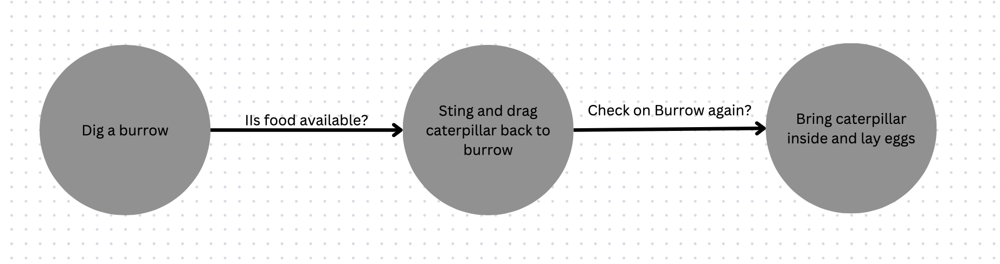

### Problem Set 2
- Due date: 
#### Problem 2.1 [20 points]
For each of the following, give a PEAS description of the task environment -- 
in a grid as in Figure 2.5 of R&N -- and characterize it in terms of the 
properties described in Section 2.3.2 of R&N, putting your answers to the that part in a grid as in Figure 2.6 of R&N.

* Exploring the subsurface oceans of Titan
* Shopping for used AI books on the Internet

| Agent Type | Performance Measure | Enviroment | Actuators | Sensors |
| ----- | ----- | ----- | ----- | ----- |
| Exploring the subsurface oceans of Titan | Materials analysis, mapping | Oceans of Titan | devices capable of exploring and collect data | Sensors, camera, sonar |
| Shopping for used AI books on the Internet | Price, Book's quality | Online market | customer action | Purchase orders, book's information | 


| Task Environment | Observable | Agents | Deterministic | Episodic | Static | Discrete |
| ---- | ---- | ---- | ---- | ---- | ---- | ---- | 
| Exploring the subsurface oceans of Titan | Fully | Multi | Deterministic | Episodic | Static | Discrete |
| Shopping for used AI books on the Internet | Partially | Single | Stochastic | Sequential | Dynamic | Discrete |


#### Problem 2.2 [10 points]
- A = {Suck, Left, Right} => |A| = 3
- P = {Clean, Dirty} => |P| = 2
- The total number of S/R agents for this problem is 3^2 = 9

| Perception | Action |
| --- | --- | 
| Clean | Right|  
| Clean | Left |
|    |    |
| Clean | Right |  
| Clean | Right |
|    |    | 
| Clean | Left | 
| Clean | Left | 
|    |    |
| Dirty | Suck | 
| Clean | Right | 
|    |    |
| Clean | Right | 
| Dirty | Suck| 
|    |    |
| Clean | Left |
| Dirty | Suck |
|    |    |
| Dirty | Suck |
| Clean | Left |
|    |    |
| Dirty | Suck |
| Dirty | Suck |


- S/R agent is a agent that only use the current percept to make decision.


#### Problem 2.3 [10 points]
Draw a state machine capturing the behavior of the sphex wasp described on page 41 of R&N.

[](Prob2.3.png)


#### Problem 2.4 [10 points]
Design (the stimulus response curves and connections for) a vehicle that circles a source at a fixed distance, as does the middle vehicle in Braitenberg's Vehicles, Figure 7 (page 18).


Problem 2.5 [10 points]
Recall the equations we wrote in class for Figure 10b on page 23 of Braitenberg's Vehicles.  Do the same for the circuit in Figure 10a, calling the input s, and the outputs of the successive threshold units (left to right) v, w, x, y, and z.


You may do this by hand or write a computer program to figure these out. Your choice.  Whatever choice, make sure the answer is organized in a well-labeled table as we did in class.


Problem 2.6 [10 points]
1. Draw the memory circuit described for Vehicle 5 (at the top of page 24 of Vehicles).
2. Draw one that will remember if it has seen more than one red light.


Note: we will use the discrete-time model of Problem 2.5 above. Thus, "2 lights" means a red light was seen at two different integer times (which might or might not be contiguous).


Thus, you should draw a total of TWO circuits:
(a) the indicated circuit from the book, which latches (and continues to ring) if the vehicle has seen a light in at least one previous time instance
(b) one of your own design that latches/rings if the vehicle has seen a light in at least two different time instances


As suggested above, to help make your designs more specific, include the buzzer/bell (like Braitenberg's example did), whose ringing signifies the condition in question.


-----


#### Problem 2.7 [30 points]


| Perception | Action |
| --- | --- |
| A, Dirty | Suck|
| A, Clean | Right|
|B, Dirty| Suck|
|B, Clean| Left|
| [A, Dirty], [A, Clean]  | Right|
| [A, Clean], [B, Dirty] | Suck |
| [B, Clean], [A, Dirty] | Suck |
| [B, Dirty], [B, Clean] | Left |
| [A, Dirty], [A, Clean], [B, Dirty] | Right |
| [B, Dirty], [B, Clean], [A, Dirty] | Left |
| [A, Clean], [A, Clean], [B, Clean] | Exit |
| [B, Clean], [B, Clean], [A, Clean] | Exit |
- Here is the main code for the simulation 
```python
def run_simulation(start_location, environment, table):
    # initialize the performance score
    score = 0
    # initialize the current location
    current_location = start_location
    # initialize the current state
    current_state = environment
    
    # loop until all rooms are clean
    while any(value == 'Dirty' for value in current_state.values()):
        # check if the current room is dirty
        if current_state[current_location] == 'Dirty':
            # clean the room
            current_state[current_location] = 'Clean'
            # increment the performance score
            score += 1
            # get the next action from the table
            next_action = table[(current_location, 'Clean')]
        else:
            # get the next action from the table
            next_action = table[(current_location, 'Clean')]
        
        # check if the next action is to move left
        if next_action == 'Left':
            current_location = 'A' if current_location == 'B' else 'B'
        # check if the next action is to move right
        elif next_action == 'Right':
            current_location = 'B' if current_location == 'A' else 'A'
    
    # print the environment, start location, and performance score
    print('Environment:', environment)
    print('Start Location:', start_location)
    print('Performance Score:', score)

# define the environment
environment = {'A': 'Dirty', 'B': 'Dirty'}
# define the start location
start_location = 'A'
# define the stimulus-response table
table = {((loc_A, 'Clean'),): 'Right',
         ((loc_A, 'Dirty'),): 'Suck',
         ((loc_B, 'Clean'),): 'Left',
         ((loc_B, 'Dirty'),): 'Suck',
         ((loc_A, 'Dirty'), (loc_A, 'Clean')): 'Right',
         ((loc_A, 'Clean'), (loc_B, 'Dirty')): 'Suck',
         ((loc_B, 'Clean'), (loc_A, 'Dirty')): 'Suck',
         ((loc_B, 'Dirty'), (loc_B, 'Clean')): 'Left',
         ((loc_A, 'Dirty'), (loc_A, 'Clean'), (loc_B, 'Dirty')): 'Suck',
         ((loc_B, 'Dirty'), (loc_B, 'Clean'), (loc_A, 'Dirty')): 'Suck'}

# run the simulation
run_simulation(start_location, environment, table)

```


- The simulation output is as follows: 
```
Environment: {'A': 'Dirty', 'B': 'Dirty'}
Start Location: A
Performance Score: 2
```
- Since the actions are the movement of the vacuum cleaner, and the state of the room either clean or dirty, so there are no exactly number for the performance score.
- The total number of S/R agents for this problem is 12, and the total number of states is 8.
