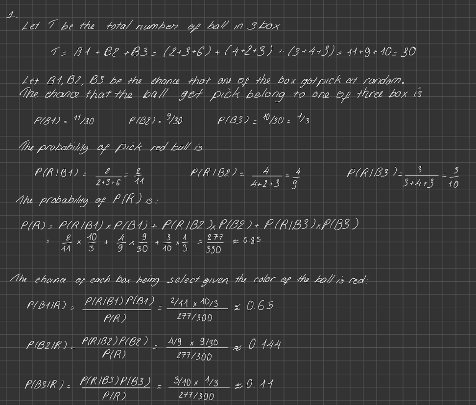

# PS8
### Reading:
- R&N 4e: Section 13.1, 13.2, 13.3.2-4, 13.4 and page 459
- Probabilistic Reasoning 1 & 2 lectures

## Problem 1: 

- Let T be the total number of ball in all 3 boxes: T = (2+3+6)
## Problem 2:
Giving the following Bayesian Network, find the probability of P(A|D) 
```
P(A) = 1/2
P(B|A) = 1
P(B|!A) = 1/2
P(C|A) = 1
P(C|!A) = 1/2
P(D|B,C) = 1
P(D|B, !C) = 1/2
P(D|!B,C) =1/2
P(D| !B, !C) = 0
```
Solution:
```
- Using the chain rule we can find:
P(!A) = 1 - P(A) = 1 - 0.5 = 0.5
P(B)= P(B|A)*P(A) + P(B|!A)XP(!A) = 1*0.5 + 0.5*0.5 = 0.75
P(!B) = 1 - P(B) = 1 - 0.75 = 0.25
P(C)= P(C|A)*P(A) + P(C|!A)XP(!A) = 1*0.5 + 0.5*0.5 = 0.75
P(!C) = 1 - P(C) = 1 - 0.75 = 0.25

- Since B and C are independent we can find:
P(B,C) = P(B)*P(C) = 0.75*0.75 = 0.5625
P(!B,!C) = P(!B)*P(!C) = 0.25*0.25 = 0.0625
P(B,!C) = P(B)*P(!C) = 0.75*0.25 = 0.1875
P(!B,C) = P(!B)*P(C) = 0.25*0.75 = 0.1875

- Now we can find P(D):
P(D) = P(D|B,C)*P(B)*P(C) + P(D|B,!C)*P(B)*P(!C) + P(D|!B,C)*P(!B)*P(C) + P(D|!B,!C)*P(!B)*P(!C) = 0.5625*0.75*0.75 + 0.1875*0.75*0.25 + 0.1875*0.25*0.75 + 0.0625*0.25*0.25 = 0.375

- Now we can find P(D|A):
P(D|A) = P(D|B,C)*P(B|A)*P(C|A) + P(D|B,!C)*P(B|A)*P(!C|A) + P(D|!B,C)*P(!B|A)*P(C|A) + P(D|!B,!C)*P(!B|A)*P(!C|A) = 1*1*1 + 0.5*1*0.5 + 0.5*0*1 + 0*0*0.5 = 0.75

- Now we can find P(A|D):
P(A|D) = P(D|A)*P(A)/P(D) = 0.75*0.5/0.375 = 1
```

- But in the case if A and D are independent:
```
P(A|D) = P(A) = 0.5
```

## Problem 3:
```
P(B)= 0.001
P(E)= 0.002
P(A|B,E) = 0.98
P(A|B,!E) = 0.95
P(A|!B,E) = 0.29
P(A|!B,!E) = 0.001
P(J|A) = 0.95
P(J|!A) = 0.01
P(M|A) = 0.7
P(M|!A) = 0.01
```
- Find P(!J,!M,B,E) 
```
P(!J,!M,B,E) = 0
P(!J,!M,B,E) = P(!J|!M,B,E) * P(!M|B,E) * P(B,E) = P(!J|!M,B,E) * P(!M|B,E) * P(B) * P(E) = 0.01 * 0.99 * 0.001 * 0.002 = 0
```

## Problem 4:
```
Fuzzy Logic
Define fuzzy sets that can be used to represent the following concepts:
a. Old (domain is real-valued age in years).
b. Not old (domain is real-valued age in years).
c. Young (domain is real-valued age in years).
d. A few (domain is positive integers).
Then answer the following question:
e. Do "Not Old" and "Young" have to be the same?
```

a. Old (domain is real-valued age in years).
- Old(x) = 1 if x > 60
- Old(x) = 0 if x < 60

b. Not old (domain is real-valued age in years).
- Not old(x) = 1 if x < 60
- Not old(x) = 0 if x > 60

c. Young (domain is real-valued age in years).
- Young(x) = 1 if x < 30
- Young(x) = 0 if x > 30


d. A few (domain is positive integers).
- A few(x) = 1 if x < 5
- A few(x) = 0 if x > 5


e. Do "Not Old" and "Young" have to be the same?
- No, they don't have to be the same. Because their fuzzy sets are different.
- Even when they are complemeentary to each other, they are not the same.

## Problem 6:
```python
from random import random

TRIALS = 10**6

evidence = 0
query = 0
pall = []
pdenomall = []
joint_observed = 0
pjointall = []

for trial in range(1,TRIALS+1):
    randB, randE = random(), random()
    B = randB < 0.001
    E = randE < 0.002
    if B and E:
        randA = random()
        A = randA < 0.98
    elif B and not E:
        randA = random()
        A = randA < 0.95
    elif not B and E:
        randA = random()
        A = randA < 0.29
    else:
        randA = random()
        A = randA < 0.001
    randJ, randM = random(), random()
    if A:
        J = randJ < 0.95
        M = randM < 0.7
    else:
        J = randJ < 0.01
        M = randM < 0.01
    # DIRECT SAMPLING FOR JOINT PROB. ESTIMATE
    if (not J) and (not M) and B and E:
        joint_observed += 1
        pjointall.append(joint_observed/trial)
    # REJECTION SAMPLING: ONLY PROCESS IF EVIDENCE True
    if not M:
        evidence += 1
        if not J:
            query += 1
        p = query/evidence
        pall.append(p)
    pdenom = evidence/trial
    pdenomall.append(pdenom)

print("P(!J,!M,B,E) ~=", pjointall[-1])
```
- Giving the following code, the output is:
``` 
P(!J,!M,B,E) ~= 0.000001
- The output is the same as the answer in problem 3.
```
- Since the estimate is based on a random sampling technique, the estimate will be different each time the code is run. But the estimate will be close to the actual probability.

## Problem 5:
```python
from random import random

TRIALS = 10**6
A = 1/2  # prior probability of A

evidence = 0
query = 0
pdenomall = []
pdnumall = []

for trial in range(1, TRIALS + 1):
    randA, randB, randC = random(), random(), random()
    A_val = randA < A  # sample A
    B_val = randB < (1 if A_val else 1/2)  # sample B
    C_val = randC < (1 if A_val else 1/2)  # sample C
    D_val = B_val and C_val  # sample D
    
    # compute denominator P(D)
    pdenom = (1 if A_val else 1/2) * (1 if B_val else 1/2) * (1 if C_val else 1/2)
    pdenomall.append(pdenom)
    
    # compute numerator P(D|A) * P(A)
    if A_val == True and D_val == True:
        pdnum = 1 * A_val
        pdnumall.append(pdnum)
    
    # increment evidence counter if D is observed
    if D_val == True:
        evidence += 1
        # increment query counter if A is not true
        if A_val == False:
            query += 1
    
print("P(A|D) ~=", sum(pdnumall)/sum(pdenomall))
```
- Since my code using the ran