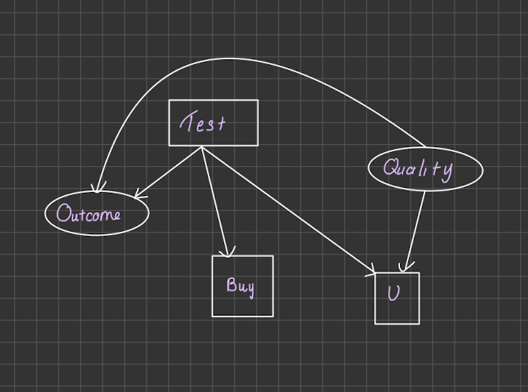
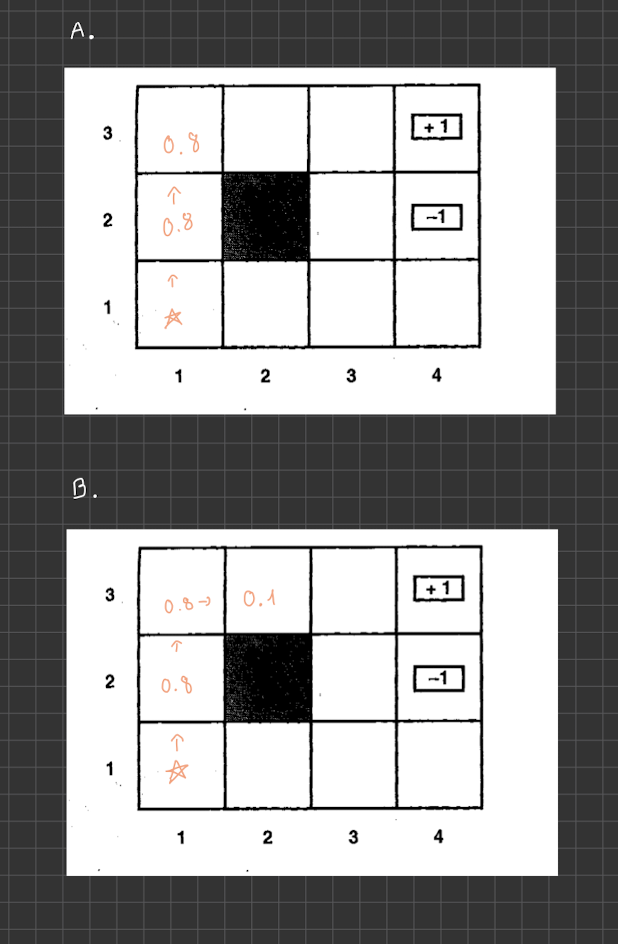

# PS9
## Problem 9.1
```
- Giving the following value: there are 2 possible prizes:
  - $10 payoff with probability 1/50
  - $1,000,000 payoff with probability 1/2,000,000
  - $1 lottery ticket

- Probability of the following outcomes:
    - Prize 1: 1/50
    - Prize 2: 1/2,000,000
    - Losing: 1 - (1/50 + 1/2,000,000) = 1 - 1/100,000 = 0.9999805

- The expected monetary value of a lottery ticket is:
        EMV = (1/50 * 10) + (1/2,000,000 * 1,000,000) = 0.2 + 0.5 = 0.7 


- To determine if it is rational to buy a lottery ticket, we need to consider the utility of the buyer.
    - Giving that the current wealth of $k and that U($k)= 0
    - U($k+10) = 10 + U($k)

- Assuming our goal is to make a profit of $10:
    - P(W) = 0.02
    - P(L) = 1 - 1/50 = 49/50 = 0.98
    - U($k+10) = 10 + U($k)
    - The chance to win $10 is 1/50, so the expected utility is:
        EU = 10 * 1/50 + U($k) = 0.2 + U($k)
    - The chance to lose is 49/50, so the expected utility is:
        EU = 0 * 49/50 + U($k) = 0 + U($k)
    - The expected utility is:
        EU = 0.2 + U($k) = 0 + U($k)
        0.2 = U($k)
        U($k) = 0.2
    

- Based on the cost in EMV and the probability of winning, we can determine
that it is rational to not buy a lottery ticket. Since we will loss money if 
we buy a lottery ticket.
```

## Problem 9.2: Buy a car
### a)

### b)
- Giving the following information about the  car
  - Cost of the car : $1,500 (good quality)
  - Market value of the car: $2,000 (good quality)
  - If car not in good quality, need to pay $700 to repair it
  - Cost of the test: $50
  - Probability of the car: P(+q) = 0.7 and P(-q) = 0.3

- The expected net gain from buying c1, given no test:
  - Expected net gain = P(+q) * (Market value - Cost) + P(-q) * (Repair Cost - Cost) 
                      = 0.7 * (2000 - 1500) + 0.3 * (700-1500) = 350 - 240 = 110
  
### c)
- Giving the following information about the car:
  - P(pass(c1,t1)|q+(c1)) = 0.8
  - P(pass(c1,t1)|q-(c1)) = 0.35
- Using Bayes's theorem, the probability of the Pass the test is:
  - P(Pass) = P(Pass|+q) * P(+q) + P(Pass|-q) * P(-q)
            = 0.8 * 0.7 + 0.35 * 0.3 = 0.665
  - P(not Pass) = 1 - 0.665 = 0.335
- If car is pass the test giving the that car is in bad shape: 
  - P(q-|Pass)= P(Pass|-q) * P(-q) / P(Pass) = 0.35 * 0.3 / 0.665 = 0.157


- If car is pass the test giving the that car is in good shape: 
  - P(q+|Pass)= P(Pass|+q) * P(+q) / P(Pass) = 0.8 * 0.7 / 0.665 = 0.842
  - P(q+|Pass) = 1 - P(q-|Pass) = 1 - 0.157 = 0.843


- If car not pass the test giving the that car is in bad shape: 
  - P(q-|not Pass)= P(not Pass|-q) * P(-q) / P(not Pass) = 0.65 * 0.3 / 0.335 = 0.582


- If car not pass the test giving the that car is in good shape: 
  - P(q+|not Pass)= P(not Pass|+q) * P(+q) / P(not Pass) = 0.2 * 0.7 / 0.335 = 0.417
  - P(q+|not Pass) = 1 - P(q-|not Pass) = 1 - 0.582 = 0.418 

### d)
- If Pass, the expected net gain is:
- EV = P(q+|Pass) * (Market value - Cost) + P(q-|Pass) * (Repair Cost - Cost) 
      = 0.843 * (2000 - 1500) + 0.157 * (700-1500) = 295.9
    
- If not Pass, the expected net gain is:
- EV = P(q+|not Pass) * (Market value - Cost) + P(q-|not Pass) * (Repair Cost - Cost) 
      = 0.417 * (2000 - 1500) + 0.582 * (700-1500) = - 257.1

## Problem 9.3: Sequential Movements


### a) Correct probability after [Up,Up]
- T((1,1),Up(1,2)) = 0.8
- T((1,2),Up(1,3)) = 0.8
- The probability of being in (1,3) is 0.8 * 0.8 = 0.64

### b) Correct probability after [Up,Up,Right]
- T((1,1),Up(1,2)) = 0.8
- T((1,2),Up(1,3)) = 0.8
- T((1,3),Right(2,3)) = 0.1
- The probability of being in (2,3) is 0.8 * 0.8 * 0.1 = 0.064


## Problem 9.4: 
```python
# Value Iteration Algorithm
def value_iteration(T, R, gamma, epsilon):
    # initialize V(s) arbitrarily
    V = dict()
    for s in range(1,12):
        V[s] = 0
    while True:
        delta = 0
        for s in range(1,12):
            v = V[s]
        V[s] = max([sum([T(s,a,snext)*(R(s,a,snext)+gamma*V[snext]) for snext in range(1,12)]) for a in range(1,5)])
        delta = max(delta, abs(v-V[s]))
        if delta < epsilon:
            break
    return V

```

